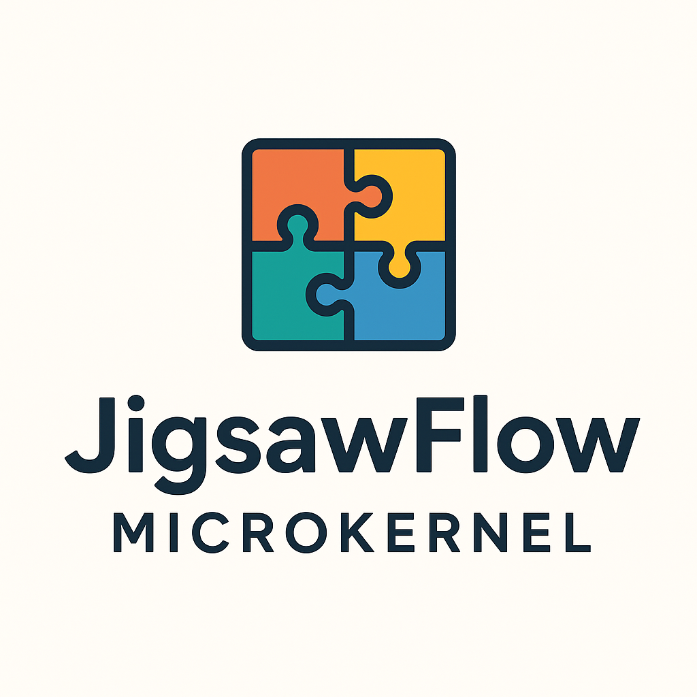

<!-- markdownlint-disable MD036 -->
<!-- markdownlint-disable MD033 -->
<!-- markdownlint-disable MD023 -->
<!-- markdownlint-disable MD041 -->

  
  
  **JigsawFlow Microkernel** — A Capability-Driven Architecture for Offline-First, Hot-Swappable, Language-Agnostic Applications
  
  _An enterprise-grade pattern for building modular polyglot software systems_
  
  > ⚠️ **Work in Progress**: This is an evolving architectural pattern. The specification and examples are actively being developed and refined based on real-world implementations and community feedback.
  

## What is JigsawFlow?

JigsawFlow is a **universal, language-agnostic host for modular applications**. Unlike traditional plugin systems that assume a main application with add-ons, JigsawFlow treats the entire application as modular—the "kernel" is almost invisible, simply enforcing contracts, lifecycle, and hot-swap capabilities.

### **Core Value Proposition**

**🚀 Single Developer Speed**  
Stop reinventing integration layers. Write a module once, reuse it everywhere. No more rebuilding authentication, logging, or data processing from scratch for each project.

**🌐 Cross-Domain Reuse**  
A module written for IoT can work in SaaS, robotics, or industrial automation. True cross-domain composition through standardized interfaces.

**🔄 Polyglot Freedom**  
Implement the same contract in Rust for speed, Python for prototyping, Node.js for networking. All implementations are functionally identical and interchangeable.

**🧪 Unified Testing**  
The same end-to-end test works across all implementations. Testing becomes diagnosis—swap a slow Python module for a fast Rust one, and your tests confirm identical behavior.

### **Beyond Plugin Systems**

Traditional plugin architectures assume a core application that plugins extend. JigsawFlow inverts this—**the whole application is modular**. There's no "main app"—just a minimal microkernel that:

- Enforces interface contracts
- Manages component lifecycle
- Enables hot-swapping without restart
- Provides graceful degradation when components are missing

This isn't just a better plugin system—it's a **fundamental shift in application development design** that will eventually replace current application-layer module systems.

## Origin Story

JigsawFlow emerged from a real-world developer productivity challenge. Imagine a developer who had standardized their workflow over years—building applications became largely copy/paste operations as most views, logic, and approaches were already covered in previous projects.

The breakthrough came when this developer decided to modularize everything: views, logic, and services. The developer created a system where a simple package manager command (git, composer, npm, or custom CLI) could add any module to the current application. APIs were formalized, modules handled their own initialization, and the application immediately knew about new capabilities.

When a customer needed user-management and invoice-management for their business, the developer simply asked a few questions and added the required modules like jigsaw pieces. The modules integrated seamlessly, offering the required functionality immediately.

Each module injected its services into a common registry, making capabilities available across the entire application through flat access patterns—no hierarchical stacking like React components, just direct capability lookup. To achieve even better decoupling, the developer formalized communication interfaces—when code used a service that wasn't available, nothing failed catastrophically. Instead, warnings were logged and the application continued operating.

Realizing that widespread community adoption of this pattern could transform application development entirely, the developer formalized this approach as the **JigsawFlow Microkernel Architecture**.

---

## The Paradigm Shift: From Software Development to Component Composition

JigsawFlow represents a fundamental transformation in how we approach software creation—shifting from traditional **software development** to **component composition**. This paradigm change mirrors successful patterns already established in pluggable platforms, but JigsawFlow goes further by unifying not only the pluggable modules but also the engine that processes them, along with standardized communication protocols.

### **The Two-Track Development Model**

This architecture naturally splits software creation into two distinct disciplines:

**1. Component Development**

- Specialists create reusable, standardized components
- Focus on specific domain expertise (authentication, payments, data processing)
- Components satisfy well-defined trait/interface contracts
- Similar to how automotive suppliers specialize in specific parts (engines, transmissions, electronics)

**2. Application Assembly**

- System architects compose working components without "glue" code
- Components integrate seamlessly through standardized interfaces
- No development experience required for basic composition
- Similar to how mechanics can replace car parts without manufacturing expertise

### **Industrial Heritage: PLC and Automotive Inspiration**

JigsawFlow draws from two proven industrial approaches that demonstrate the power of standardized component interfaces:

**PLC Systems:** Signal-driven components with standardized I/O interfaces enable process control through modular, replaceable units. However, they're limited to single-domain industrial automation.

**Automotive Industry:** Cross-manufacturer component compatibility through standardized interfaces (electrical connections, mounting points, CAN bus protocols) allows any garage to replace parts without engineering expertise.

**JigsawFlow's Innovation:** Combines the best of both—PLC-style modular components with automotive-style cross-domain standardization, enabling components from different vendors, languages, and domains to interoperate seamlessly through universal trait/interface contracts.

### **Addressing Industry Standardization**

This approach directly addresses a critical issue in software development:

> Software development suffers from a lack of standardized role definitions and salary bands. Unlike regulated professions such as medicine, compensation in IT is fluid, inconsistent, and often opaque, driven by market forces rather than formal structures.

JigsawFlow's component-based model creates natural role specialization:

- **Component Specialists**: Deep domain experts creating certified, reusable components
- **System Integrators**: Architects composing components into complete applications
- **Maintenance Technicians**: Operators replacing and updating components in production

This specialization enables clearer role definitions, standardized skill requirements, and more predictable career paths—similar to how the automotive industry has distinct roles for design engineers, assembly technicians, and service mechanics.

### **Beyond Domain-Locked Platforms**

Existing modular systems (WordPress plugins, VS Code extensions, PLC modules, automotive ECUs) are domain-specific. JigsawFlow breaks these boundaries by unifying:

1. **Universal Component Interfaces**: Trait/interface contracts that work across any domain
2. **Cross-Language Processing Engine**: Rust and PHP engines can interact seamlessly
3. **Multi-Protocol Communication**: From industrial Modbus to web HTTP, all through standardized patterns

This enables **true cross-domain composition**—imagine a Rust-based data processing component working with PHP web components and PLC control modules in the same application, all hot-swappable without system knowledge.

---

## Overview

JigsawFlow is a revolutionary microkernel architecture that transforms how enterprise applications are built through a **singleton registry pattern**. Inspired by battle-tested industrial automation systems like PLCs and SCADA architectures, as well as the automotive industry's standardized component approach, JigsawFlow enables developers to construct robust applications where components access capabilities via standardized traits/interfaces rather than direct coupling.

**Core Philosophy**: JigsawFlow applications emerge from a **singleton registry** that provides trait/interface-based access to all application capabilities. Components can optionally communicate through event-driven patterns when an event orchestrator component is present, but the registry remains the fundamental architecture. Applications can range from simple single-component solutions to complex event-driven networks, all built on the same registry foundation.

The architecture centers on a **singleton registry microkernel** that provides trait/interface-based access to capabilities, with optional event-driven communication when components require it, creating applications that scale through flat capability access rather than hierarchical structural complexity.

### **What Makes JigsawFlow Different?**

**Traditional Approach**: Components have direct dependencies and tight coupling between services.

**JigsawFlow Registry Approach**: Components access capabilities through trait/interface contracts via the singleton registry. When components need event-driven communication, they access an event orchestrator component through the same registry pattern. If no event orchestrator is registered, components gracefully degrade with logging warnings rather than failing.

**Language-Specific Implementations:**

- **Rust**: Trait-based registry access
- **Java/C#**: Interface-based registry access
- **TypeScript**: Type-based registry access
- **Go**: Interface-based registry access

This microkernel enables **capability-based scaling** where applications grow through registry-provided capabilities rather than structural complexity.

### **Unix Microkernel Principles at Application Level**

JigsawFlow applies proven Unix design principles to application architecture:

| **Unix Principle**                 | **JigsawFlow Application**                       |
| ---------------------------------- | ------------------------------------------------ |
| "Everything is a file"             | "Everything is a capability"                     |
| Small tools that do one thing well | Small components with focused responsibilities   |
| Compose via pipes                  | Compose via singleton registry                   |
| Process independence               | Component independence with graceful degradation |
| Hot-swappable kernel modules       | Hot-swappable application components             |

### **Emergent Capability Composition**

The real innovation is **emergent capability access**:

- **Traditional Architecture**: Predefined component hierarchies and explicit dependencies
- **JigsawFlow Architecture**: Applications emerge from available capabilities accessed through trait/interface contracts

This creates a **capability-centric microkernel** where complex applications arise from simple registry access patterns—similar to how Unix achieved emergent complexity from file and process abstractions.

---

## Why JigsawFlow?

### **Industrial-Strength Foundation**

JigsawFlow draws inspiration from proven industrial patterns:

- **PLC Systems**: Modular, signal-driven components with standardized interfaces
- **SCADA Architecture**: Centralized control with distributed, autonomous components
- **Automotive Industry**: Standardized component interfaces enabling cross-manufacturer compatibility
- **Component-Based Software Engineering (CBSE)**: Reusable, qualified components with defined interfaces
- **Microservice Orchestration**: Loosely coupled services with clear boundaries

### **Enterprise Benefits**

- **Rapid Application Assembly**: Build complex systems by composing pre-built components
- **Zero-Restart Hot-Swapping**: Replace functionality without application downtime (Phase 1 supports DI singleton replacement; Phase 2 adds dynamic library loading via RuntimeSwap)
- **Cross-Domain Polyglot Architecture**: Build applications spanning multiple domains and languages—a Rust-based data processing engine can seamlessly interact with PHP-based web components, enabling true cross-domain composition through standardized communication protocols (Bluetooth, P2P, TCP/IP, UDP, Modbus, IPC, ...)
- **Minimal Integration Overhead**: Singleton registry handles component coordination
- **Community-Driven Ecosystem**: Shared component repository for common functionality

---

## Core Architecture

### **Microkernel Components**

**1. Universal Singleton Registry**

A trait/interface-based singleton store that manages ALL application singletons:

- **Components**: Functional blocks providing capabilities
- **Foundation Infrastructure**: Configs, utilities, models, core services
- **Service Interfaces**: Trait/interface implementations
- **Application State**: Any singleton struct relevant to the application

Features:

- Hot-swappable singleton replacement without restart
- Language-agnostic trait/interface-based access
- Thread-safe concurrent access patterns

**2. Optional Communication Components**

When communication components are registered, they enable various interaction patterns:

- **Event-Driven Communication**: Event orchestrator component provides publish/subscribe capabilities
- **Network Communication**: HTTP, TCP/IP, UDP components provide network-based interaction
- **Inter-Process Communication**: IPC components enable process-to-process communication
- **Device Communication**: Bluetooth, serial, or other protocol components for device interaction
- **Graceful Degradation**: When communication components are missing, applications log warnings and continue
- **Unified Access Pattern**: All communication types accessed through trait/interface contracts via registry

### **Component vs Plugin Distinction**

JigsawFlow uses precise terminology to distinguish between architectural and deployment concepts:

**JigsawFlow Component:**

- Core architectural element that registers with the singleton registry
- Provides specific capabilities through well-defined interfaces
- Behaves like a PLC component with focused responsibilities
- Can be hot-swapped at runtime without application restart
- Examples: Storage Component, Authentication Component, Logging Component

**Plugin:**

- Deployment package that extends application functionality
- May contain one or more components along with additional resources
- Physical distribution mechanism (files, libraries, packages)
- Brings complete solutions including configs, assets, documentation
- Examples: User Management Plugin (containing Auth Component + Profile Component + UI assets)

**Relationship:** Plugins are containers that deliver components to applications. A plugin typically packages related components together with their supporting resources for easy installation and distribution.

### **Three Component Types**

**1. Foundation Components**
Base application infrastructure registered as singletons: configurations, database pools, loggers, utilities, and core services that other components access via trait/interface contracts.

**2. Reactive Components**
Components that access communication capabilities (event orchestrator, HTTP, TCP/IP, UDP, IPC, Bluetooth) through the registry. When communication components are missing, they log warnings and operate in degraded mode rather than failing.

**3. Proactive Components**
Components that drive application behavior through registry-provided capabilities. They may access communication capabilities (events, HTTP, TCP/IP, UDP, IPC, Bluetooth) when available, or operate through direct registry access patterns.

### **Registry-Based Application Assembly**

Applications emerge through **capability registration**:

1. **Initialize Microkernel**: Start singleton registry
2. **Load Foundation Components**: Register base infrastructure (configs, utilities, core services)
3. **Register Capability Components**: Register domain logic components providing trait/interface implementations
4. **Start Application Components**: Components access required capabilities through registry
5. **Optional Communication Enhancement**: Register communication components (event orchestrator, HTTP, TCP/IP, UDP, IPC, Bluetooth) when inter-component or external communication is needed

Components discover and access capabilities through trait/interface-based registry calls, creating scalable applications that gracefully degrade when optional capabilities are missing.

### **The Requirements**

JigsawFlow components must adhere to three fundamental architectural constraints:

- **Offline-First Design**: Components must function when network connectivity is lost (WiFi down, cables cut) but may utilize network protocols when available
- **Component Independence**: Components must not directly depend on other components. Components access capabilities through trait/interface contracts via the registry; when required capabilities are unavailable, components must log warnings and degrade gracefully rather than failing
- **Facade Pattern**: All external dependencies (file I/O, environment access, system calls) must be wrapped through singleton registry facades

_See [best-practices.md](best-practices.md) for detailed implementation guidance and testing strategies._

---

## Use Cases

### **Enterprise Application Development**

Transform monolithic applications into composable, maintainable systems:

- **API Gateways**: HTTP + Authentication + Logging + Monitoring components
- **Data Processing Pipelines**: Input + Transform + Output + Persistence components
- **IoT Platforms**: Device Communication + Data Collection + Analytics components

### **Industrial Automation & Automotive**

Leverage familiar PLC and automotive-style programming for software systems:

- **Process Control**: Sensor Input + Logic Processing + Actuator Output components (PLC-style)
- **SCADA Integration**: Data Acquisition + Supervisory Control + HMI components
- **Manufacturing Execution**: Workflow + Quality Control + Reporting components
- **Automotive Systems**: ECU Communication + Diagnostic + Control Module components

### **Desktop & GUI Applications**

Transform traditional desktop development through distributed GUI architecture:

- **Cross-Platform Applications**: GUI Rendering + Business Logic + Data Persistence components
- **Development Tools**: Code Editor + Compiler + Debugger + GUI Dashboard components
- **System Administration**: Monitoring + Configuration + GUI Interface components
- **Network-Distributed Apps**: Remote business logic + Local GUI rendering via P2P connections

### **Microservice Orchestration**

Simplify complex distributed system management:

- **Service Mesh**: Discovery + Load Balancing + Circuit Breaking components
- **Event Processing**: Message Routing + Stream Processing + State Management components
- **DevOps Automation**: CI/CD + Monitoring + Alerting + Deployment components

---

## Positioning vs. known patterns

| Pattern                          | What it is                          | Where JigsawFlow differs                                                                    |
| -------------------------------- | ----------------------------------- | ------------------------------------------------------------------------------------------- |
| Microkernel / Plug‑in            | Minimal core with plug‑ins          | You formalize plug‑in capabilities and offline‑first guarantees                             |
| Hexagonal (Ports & Adapters)     | Domain wrapped by ports             | Ports/adapters map to service interfaces; singleton registry discovers/binds                |
| Service‑oriented / Microservices | Network‑separated services          | JigsawFlow can be in‑proc or cross‑proc; components are composable without service overhead |
| Actor model                      | Isolated entities exchange messages | Your components can adopt actors internally; the bus covers inter‑component traffic         |
| OSGi/Module systems              | Runtime module lifecycles           | You keep it language‑agnostic and simpler (no classloader tricks)                           |

---

## Future Enhancements

### **Language-Agnostic Interface Standards**

Establish a comprehensive collection of standardized traits/interfaces for common functionality across all supported languages. This standardization addresses two critical areas:

**1. Trait/Interface Standards**

- Define standardized capability contracts (Storage, Authentication, Logging, etc.)
- Enable community-driven component development through well-defined problem-solution interfaces
- Create language-agnostic specifications that translate to idiomatic implementations
- Establish component certification and compatibility frameworks

**2. Event Communication Standards**

- Standardize event-driven communication patterns through trait/interface-based events
- Define event contracts and message shapes for inter-component communication
- Enable components to emit/subscribe to events implementing specific traits/interfaces
- Support both intra-application and cross-application communication networks
- Create rich, standardized communication vocabulary for component networks

This extends industrial automation's proven approach—where standardized protocols enable reliable polyglot systems—beyond simple signals to rich, trait-based communication networks spanning any domain.

### **GUI-as-a-Service Architecture**

**Distributed GUI Rendering Capabilities**

JigsawFlow enables revolutionary GUI architecture where applications become pure business logic while GUI rendering becomes a dedicated capability component:

- **Contract-Based GUI Rendering**: Applications send declarative UI specifications via communication components when available, eliminating the need for GUI libraries in business logic
- **Language-Agnostic GUI Services**: Backend services in Rust, Python, Go, etc. leverage unified GUI infrastructure without language-specific bindings
- **Hot-Swappable UI Components**: GUI components update independently from application logic, enabling live UI theming and layout changes
- **Network-Distributed Applications**: P2P secure connections enable GUI components to run on different machines—applications become truly distributed without installation requirements
- **WorkFlows OS Integration**: GUI service components serve as core system services, providing unified desktop experiences across all applications

**Revolutionary Distribution Model**

The most exciting aspect: applications no longer require local installation. Through secure P2P networking:

- Business logic runs on remote nodes
- GUI renders locally via service contracts
- Applications distribute dynamically across network topology
- Zero-installation application ecosystem emerges naturally

This transforms software distribution from "install and run" to "connect and compose"—applications become network-native capabilities that assemble on-demand.

### **Dynamic Loading Capabilities**

**RuntimeSwap Component Development**

- Hot-loading of dynamic libraries without application restart
- Advanced component versioning and compatibility management
- Runtime component replacement with dependency resolution
- Enhanced security models and sandboxing options for untrusted components
- Performance optimization for dynamic loading scenarios

### **Ecosystem Expansion**

**Community Infrastructure**

- Central component registry with discovery and distribution capabilities
- Community contribution frameworks with quality assurance processes
- Cross-language component bridging and interoperability testing
- Advanced orchestration and monitoring tools for complex component-based systems
- Developer tooling for component creation, testing, and debugging

**Component Governance & Security**

- **Official Component Certification**: Community-vetted components marked as "JigsawFlow Official" (similar to Docker Official Images)
- **Community Voting System**: Democratic selection of idiomatic solutions for common problems
- **Security Inspection Process**: Peer review and automated security scanning for component validation
- **Standard Solution Registry**: Community-defined canonical approaches (similar to WooCommerce in WordPress ecosystem)
- **Trust Levels**: Graduated trust system from community contributions to enterprise-certified components

---

## Architecture Comparison

| Pattern        | Coupling              | Hot-Swap   | Cross-Domain | Communication Types | Interface Focus   | Offline-First | Language-Agnostic | Graceful Degradation | Industrial Heritage |
| -------------- | --------------------- | ---------- | ------------ | ------------------- | ----------------- | ------------- | ----------------- | -------------------- | ------------------- |
| **JigsawFlow** | Loose (DI Registry)   | ✅ Yes     | ✅ Yes       | ✅ Multi-Protocol   | ✅ Trait-based    | ✅ Yes        | ✅ Yes            | ✅ Yes               | ✅ PLC/Automotive   |
| PLC Systems    | Loose (Signal Bus)    | ⚠️ Limited | ❌ No        | ⚠️ Signal-based     | ✅ Standard I/O   | ✅ Yes        | ❌ No             | ⚠️ Limited           | ✅ Industrial       |
| Automotive ECU | Loose (CAN Bus)       | ⚠️ Limited | ⚠️ Limited   | ⚠️ CAN/LIN          | ✅ Standard       | ✅ Yes        | ❌ No             | ⚠️ Limited           | ✅ Automotive       |
| Traditional DI | Medium (Framework)    | ❌ No      | ❌ No        | ❌ In-Process       | ⚠️ Type-based     | ⚠️ Depends    | ❌ No             | ❌ No                | ❌ No               |
| Microservices  | Loose (Network)       | ✅ Yes     | ⚠️ Limited   | ⚠️ Network Only     | ⚠️ API-based      | ❌ No         | ✅ Yes            | ⚠️ Circuit Breaker   | ❌ No               |
| Plugin Systems | Medium (Callbacks)    | ⚠️ Limited | ❌ No        | ❌ Callbacks        | ❌ Implementation | ⚠️ Depends    | ❌ No             | ❌ No                | ❌ No               |
| ECS Pattern    | Tight (Entity Tables) | ❌ No      | ❌ No        | ❌ Component Data   | ❌ Component      | ⚠️ Depends    | ❌ No             | ❌ No                | ❌ No               |
| OSGi/JPMS      | Medium (Modules)      | ✅ Yes     | ❌ No        | ❌ In-Process       | ⚠️ Service-based  | ⚠️ Depends    | ❌ Java Only      | ❌ No                | ❌ No               |
| Actor Model    | Loose (Messages)      | ⚠️ Limited | ❌ No        | ✅ Message Passing  | ⚠️ Message-based  | ⚠️ Depends    | ✅ Yes            | ✅ Supervision       | ❌ No               |

---

## 📚 Documentation

This repository contains comprehensive documentation to help you understand and implement JigsawFlow:

### **Core Documentation**

- **[📖 README.md](README.md)** _(this document)_ - Project overview, architecture principles, and getting started guide
- **[🏗️ Best Practices](best-practices.md)** - Implementation patterns, architectural requirements, and development guidelines for building robust JigsawFlow applications
- **[💡 Implementation Examples](implementation-examples.md)** - Real-world examples demonstrating JigsawFlow patterns across different technologies and domains

### **Quick Navigation**

| Document                       | Purpose                            | Best For                    |
| ------------------------------ | ---------------------------------- | --------------------------- |
| **README.md**                  | Architecture overview & philosophy | Understanding core concepts |
| **best-practices.md**          | Implementation guidance & patterns | Building production systems |
| **implementation-examples.md** | Practical code examples            | Learning through examples   |

---

## Getting Started

### **For Developers**

1. **Explore Examples**: Review reference implementations in your preferred language _(implementations in progress)_
2. **Define Interfaces**: Create trait/interface definitions for your domain
3. **Build Components**: Implement interface-compliant components
4. **Compose Applications**: Use singleton registry to access capabilities

> **Note**: Reference implementations are currently being developed. See [implementation-examples.md](implementation-examples.md) for current progress and conceptual examples.

### **For Enterprises**

1. **Assess Current Architecture**: Identify monolithic components suitable for component-based composition
2. **Plan Migration Strategy**: Design interface boundaries and component responsibilities
3. **Pilot Implementation**: Start with non-critical system components
4. **Scale Adoption**: Expand component-based approach across application portfolio

### **For Contributors**

1. **Join Community**: Participate in architecture discussions and RFC process
2. **Develop Components**: Create reusable components for common enterprise needs
3. **Improve Tooling**: Enhance developer experience and debugging capabilities
4. **Share Knowledge**: Write tutorials, case studies, and best practices

---

## Community & Ecosystem

### **Success Metrics**

- **GitHub Engagement**: Stars, issues, and community contributions
- **Component Ecosystem**: Number of available components and their adoption
- **Enterprise Adoption**: Applications successfully built using JigsawFlow pattern
- **Cross-Language Support**: Implementation across multiple programming languages

### **Development Roadmap**

- **Q1 2025**: Core pattern specification and reference implementation _(in progress)_
- **Q2 2025**: Developer tooling and documentation _(in progress)_
- **Q3 2025**: RuntimeSwap component and dynamic loading capabilities _(planned)_
- **Q4 2025**: Central registry and community contribution platform _(planned)_

> **Current Focus**: Refining core architectural patterns and developing reference implementations based on real-world usage in production systems.

---

## Contributing

We welcome contributions from developers, architects, and industrial automation experts. Whether you're building components, improving documentation, or sharing use cases, your input helps shape the future of component-based application architecture.

**Get Involved**:

- 📖 Read our [Contributing Guidelines](CONTRIBUTING.md)
- 💬 Join discussions in [GitHub Issues](https://github.com/dominikj111/JigsawFlow/issues)
- 🔧 Submit pull requests for improvements
- 📝 Share your JigsawFlow success stories

---

## License

**Code:** JigsawFlow is released under the [CC0 1.0 Universal (Public Domain Dedication)](https://creativecommons.org/publicdomain/zero/1.0/).  
This dedicates the code to the public domain—**you can copy, modify, distribute, and use it for any purpose, without any restrictions or attribution requirements**.

**Documentation and Examples:** All documentation, tutorials, and example materials are released under the [Creative Commons Attribution-ShareAlike 4.0 International License (CC BY-SA 4.0)](https://creativecommons.org/licenses/by-sa/4.0/).  
You are free to share and adapt these materials **as long as you give appropriate credit and distribute any derivative works under the same license**.

We believe in open, collaborative development that benefits the entire software engineering community.

---

**Ready to revolutionize your application architecture?** Start exploring JigsawFlow today and discover the power of industrial-grade modular composition.
